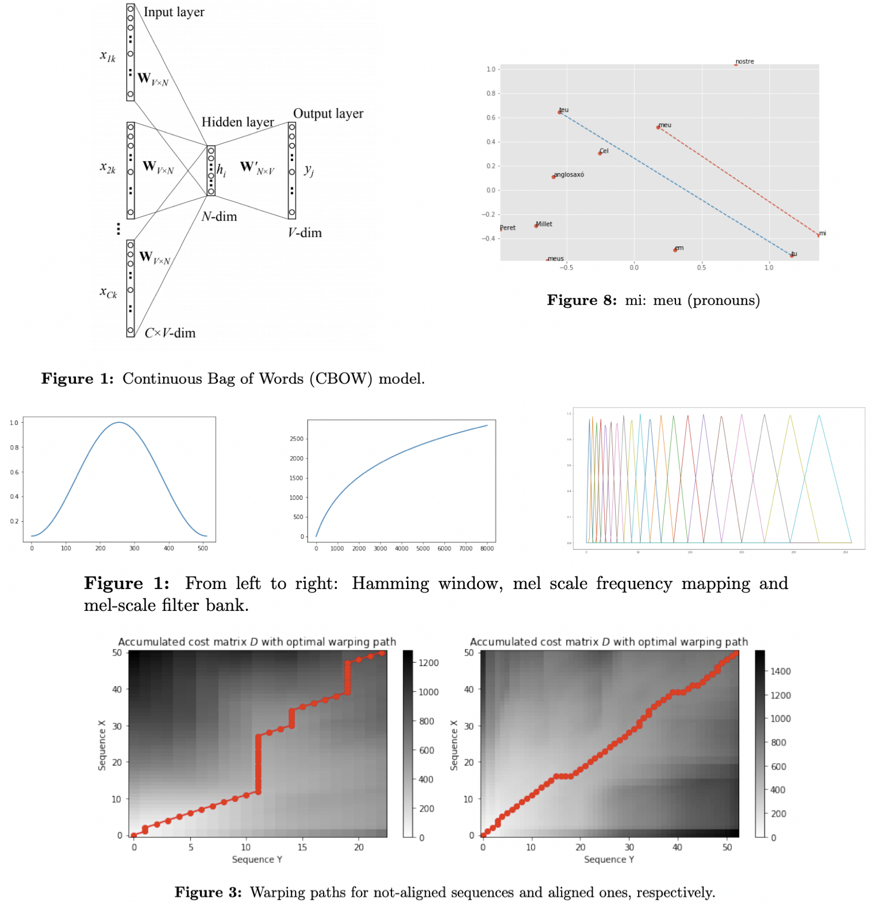

## Assignments about Spoken and Written Language Processing

Notebooks and project deliverables of the laboratory tasks carried out in the Spoken and Written Language Processing subject of the Bachelor Degree in Data Science and Engineering, on Spring 2020 semester.




### Contents

```
.
├── Assignment 1 - Catalan Word Vectors. Training and analysis
│   ├── POE_assignment_1.pdf
│   └── code
│       ├── CBOW_preprocessing.ipynb
│       ├── CBOW_training.ipynb
│       └── Word_Vectors_Analysis.ipynb
├── Assignment 2 - Language models
│   ├── POE_assignment_2.pdf
│   └── code
│       └── Transformer_Layer.ipynb
├── Assignment 3 - Language Identification. Sentence Classification
│   ├── POE_assignment_3.pdf
│   └── code
│       ├── LSTM_baseline.ipynb
│       └── LSTM_baseline_Bigram.ipynb
└── Assignment 4 - Speech Recognition using Dynamic Time Warping
    ├── POE_assignment_4.pdf
    └── code
        └── DTW_baseline.ipynb
```